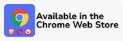

<div align='center'>

  [](https://github.com/YouG-o/YouTube_No_Translation/releases/latest)
  [](https://github.com/YouG-o/YouTube_No_Translation/stargazers)
  [](https://github.com/YouG-o/YouTube_No_Translation/graphs/contributors)
  [](https://addons.mozilla.org/firefox/addon/youtube-no-translation/)
  [](https://chromewebstore.google.com/detail/youtube-no-translation/lmkeolibdeeglfglnncmfleojmakecjb)
  

</div>

###

<div align="center">

  

  ###

  # YouTube No Translation

  A web browser extension that keeps your YouTube experience authentic by preventing automatic translations.
  The extension is available on Chromium browsers, Firefox and Safari.

  <br>


  [](https://addons.mozilla.org/firefox/addon/youtube-no-translation/)
  [](https://chromewebstore.google.com/detail/youtube-no-translation/lmkeolibdeeglfglnncmfleojmakecjb)  
  [](https://microsoftedge.microsoft.com/addons/detail/dflkepcdbnjbbfdokanhhdeolodkcofb)


  <br>

  You can get the Firefox and Chrome extensions on their official stores, but **for Safari you must [build it yourself](#build-it-yourself)**. I do not provide support for Safari.

</div>


###

<div align="center">

  ## Features:

</div>
  
- **Video Titles**: Keep titles in their original language (Video titles, Shorts, Notifications...)
- **Audio Tracks**: Always use the original audio track (or choose a specific one)
- **Descriptions**: Prevent automatic translation of videos descriptions
- **Subtitles**: Set your preferred subtitle language, if unavailable, subtitles are disabled (auto generated ones are ignored)

You can enable YouTube Data API v3 (requires your own API key) for the most reliable and fastest way to fetch original data. [Learn more](./docs/YT_DATA_API.md).<br>


If you want to use the [DeArrow](https://github.com/ajayyy/DeArrow) extension alongside this one  [PLEASE CHECK THIS](./docs/DEARROW_SUPPORT.md) to avoid any conflicts.


###


<div align="center">
  
  # Build it yourself

</div>

  While the extension is available through the official stores, you can also build it from source:

  ### Prerequisites
  - Node.js
  - npm
  - **For Safari**: macOS with Xcode installed

  ### Installation
  ```bash
  # Clone the repository
  git clone https://github.com/YouG-o/YouTube_No_Translation.git
  cd YouTube_No_Translation

  # Install dependencies
  npm install
  ```

  ```bash
  # Build for Firefox
  npm run package:firefox
  ```

  ```bash
  # Build for Chromium
  npm run package:chromium
  ```

  ```bash
  # Build for Safari (macOS only)
  npm run prepare:safari
  open "safari-extension/YouTube No Translation/YouTube No Translation.xcodeproj"
  # Then build and run in Xcode to generate the .app
  ```


###

<div align="center">
  
  # Contributors:
  

  Contributions are welcome! Whether you want to fix bugs, add features, or improve documentation, your help is appreciated.
  Please read [CONTRIBUTING.md](CONTRIBUTING.md) to get started, or browse [existing issues](https://github.com/YouG-o/YouTube_No_Translation/issues) to see what needs help.

  <br>

  
  Thanks to all [contributors](./docs/CONTRIBUTORS_LIST.md) !
  <br>
  

  
</div>

###

<div align="center">
  
  # Support This Project

</div>  

This extension is completely free and open-source. If you find it valuable, you can support its development with a pay-what-you-want contribution!

<br>

<div align="center">

  [](https://ko-fi.com/yougo)
    
  [](https://youtube-no-translation.vercel.app/?donate=crypto)

</div>

<br>

You can also support this project by:

- Starring this repository
- Rating the extension on [Mozilla Add-ons](https://addons.mozilla.org/firefox/addon/youtube-no-translation/) or the [Chrome Web Store](https://chromewebstore.google.com/detail/youtube-no-translation/lmkeolibdeeglfglnncmfleojmakecjb)
- Following me on [GitHub](https://github.com/YouG-o)

###

<div align="center">

  # LICENSE


This project is licensed under the [GNU Affero General Public License v3.0](LICENSE)

</div>