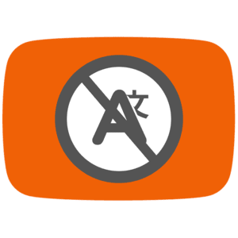
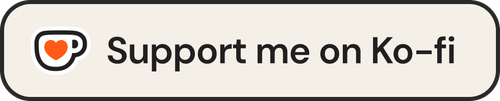

<div align="center">
  
  
  
</div>
<div align="center">
  <a href="https://github.com/YouG-o/YouTube_No_Translation/releases/latest" target="_blank">
    
  </a>
  <a href="https://github.com/YouG-o/YouTube_No_Translation/stargazers" target="_blank">
    
  </a>
  <a href="https://addons.mozilla.org/firefox/addon/youtube-no-translation/" target="_blank">
    
  </a>
  <a href="https://chromewebstore.google.com/detail/youtube-no-translation/lmkeolibdeeglfglnncmfleojmakecjb" target="_blank">
    
  </a>
  <a href="https://github.com/YouG-o/YouTube_No_Translation/blob/main/LICENSE" target="_blank">
    
  </a>
</div>

###

<div align="center">
  <a href="https://youtube-no-translation.vercel.app/" target="_blank">
    
  </a>
</div>

###

<h1 align="center">YouTube No Translation</h1>


  A web browser extension that keeps your YouTube experience authentic by preventing automatic translations.
  The extension is available on Chromium browsers, Firefox and Safari.


<div align="center">
  <a href="https://addons.mozilla.org/firefox/addon/youtube-no-translation/" target="_blank">
    
  </a>
  <a href="https://chromewebstore.google.com/detail/youtube-no-translation/lmkeolibdeeglfglnncmfleojmakecjb" target="_blank">
    
  </a>
  <br>
</div>

You can get the Firefox and Chrome extensions on their official stores, but for Safari you MUST [build it yourself](#build-it-yourself). I do not provide support for Safari.

###

<div>
  <h1 align="center">Features :</h1>
  
  - **Video Titles**: Keep titles in their original language
  - **Audio Tracks**: Always use the original audio track
  - **Descriptions**: Prevent description translations
  - **Subtitles**: Set your preferred subtitle language, if unavailable, subtitles are disabled (auto generated ones are ignored)
</div>

###

<div>
  <h1 align="center">Support This Project</h1>
  
  <p>This extension is completely free and open-source. If you find it valuable, you can support its development with a pay-what-you-want contribution!</p>

  <div align="center">
    <a href="https://ko-fi.com/yougo" target="_blank">
      
    </a>
    <br>
    <a href="https://youtube-no-translation.vercel.app/?donate=crypto" target="_blank">
      
    </a>
  </div>
  
  <p>You can also support this project by:</p>
 
  - Starring this repository
  - Rating the extension on [Mozilla Add-ons](https://addons.mozilla.org/firefox/addon/youtube-no-translation/) or the [Chrome Web Store](https://chromewebstore.google.com/detail/youtube-no-translation/lmkeolibdeeglfglnncmfleojmakecjb)
  - Following me on [GitHub](https://github.com/YouG-o)

###


<div>
  <h1 align="center" id="build-it-yourself">Build it yourself</h1>

  <p>While the extension is available through the official stores, you can also build it from source:</p>

  ### Prerequisites
  - Node.js
  - npm
  - **For Safari**: macOS with Xcode installed

  ### Installation
  ```bash
  # Clone the repository
  git clone https://github.com/YouG-o/YouTube_No_Translation.git
  cd YouTube_No_Translation

  # Install dependencies
  npm install
  ```

  ```bash
  # Build for Firefox
  npm run package:firefox
  ```

  ```bash
  # Build for Chromium
  npm run package:chrome
  ```

  ```bash
  # Build for Safari (macOS only)
  npm run prepare:safari
  open "safari-extension/YouTube No Translation/YouTube No Translation.xcodeproj"
  # Then build and run in Xcode to generate the .app
  ```

</div>

###

<div align="center">
  <h1>Contributors</h1>
  
   Thanks to [Seva41](https://github.com/Seva41) for the Safari port.

  <a href="https://github.com/YouG-o/YouTube_No_Translation/graphs/contributors">
    
  </a>
</div>

###

<div align="center">
  <h2>License</h2>
  This project is licensed under the <a href="LICENSE">GNU Affero General Public License v3.0</a>.
  <br>
  Any reuse, modification or distribution of this code must credit the original author.
  <br>
</div>

###
