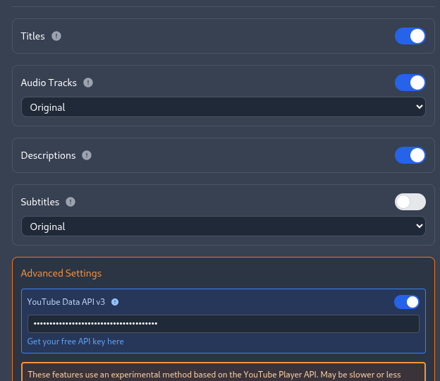

# YouTube Data API v3

## Usage in the Extension

The extension now covers all possible use cases with the YouTube Data API v3.  
You cannot do more with the API than what is already implemented.

**Why still use the Data API?**  
- It remains the most reliable and fastest way to retrieve original titles, videos descriptions and channel names.
- Batch requests (up to 50 videos at once) are supported, making updates much faster and more robust than every other methods used.

**Note:**  
Using the YouTube Data API requires your own API key.

## How to get your API key

Go to the official Google documentation:  
https://developers.google.com/youtube/v3/getting-started  
Everything is explained step by step to create a project and generate an API key.

**Note:**  
By default, the API has a limit of 10,000 units (requests) per day (the extension only uses methods that need 1 unit/request), which is more than enough for most users. Especially now that we only make 1 request for 50 different videos.

## How to use the key in the extension

1. Open the extension popup.
2. Enable the "YouTube Data API" option.
3. Enter your API key in the dedicated field (your key will be stored locally, only you have access to it).

